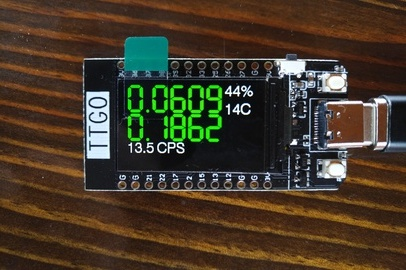

# atom-fast-esp32

Интерфейс для дозиметра Atom Fast на базе ESP32 с экраном

Железка [TTGO T-Display](https://github.com/Xinyuan-LilyGO/TTGO-T-Display)

На экране:

* Большие цифры сверху - мощность дозы в мкЗв/ч
* Большие цифры ниже - накопленная доза в мкЗв
* Под большими цифрами - количество импульсов/сек
* Справа - заряд аккумулятора в % и температура окружающего воздуха

При срабатывании установленного в дозиметре порога мощности дозы или дозы большие цифры становятся красными до того момента, пока сработка не прекратится
